<p align="center">
  <h1 align="center">🐦 Mini Twitter</h1>
  <p align="center">
    Uma plataforma de microblogging moderna construída com <strong>Next.js 16</strong>, <strong>React 19</strong> e <strong>TypeScript</strong>.
    <br />
    Desafio técnico para vaga de Desenvolvedor Front-end — <strong>B2BIT</strong>
  </p>
</p>

<p align="center">
  
  
  
  
  
</p>

---

## 📸 Screenshots

### Autenticação

| Login | Cadastro |
|:---:|:---:|
| 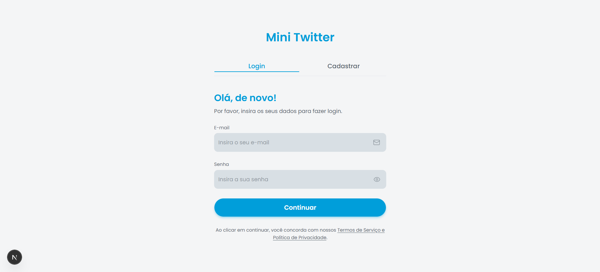 | 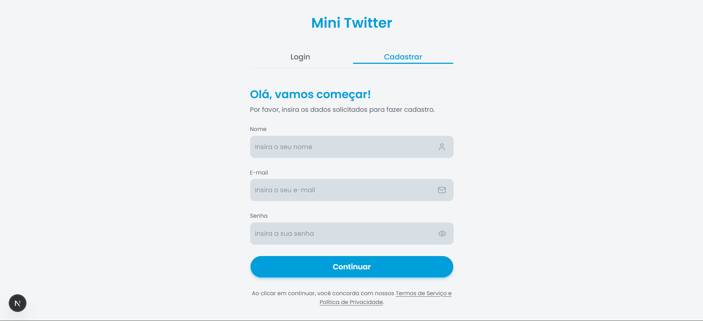 |
| 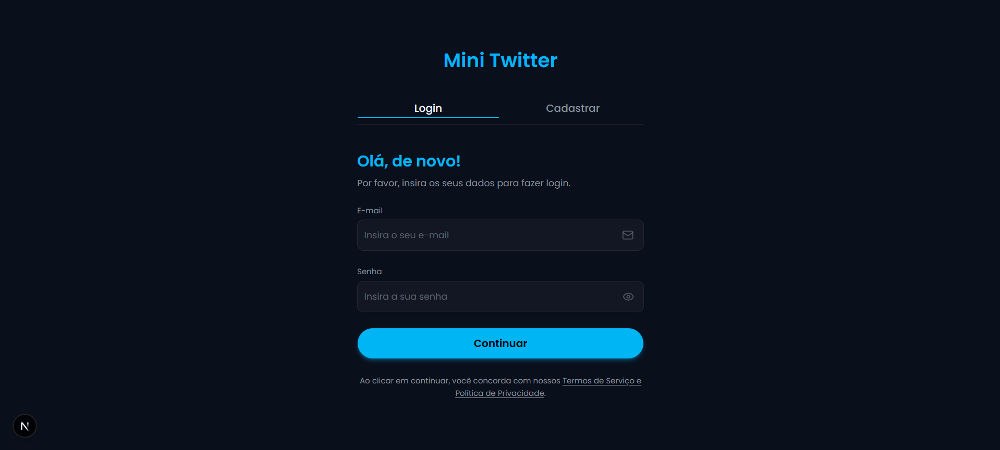 | 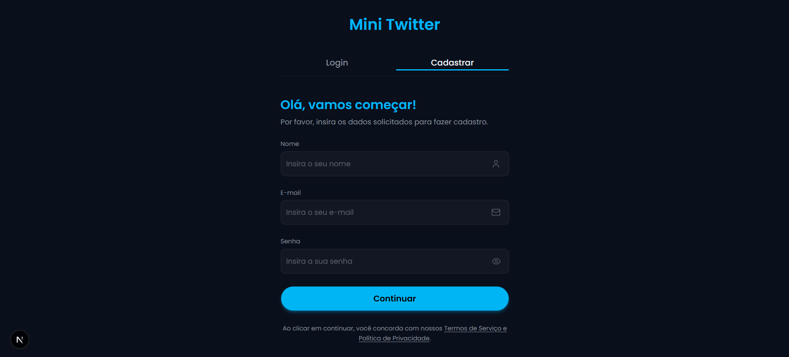 |

### Timeline & Criação de Posts

| Timeline | Criação de Post com Upload |
|:---:|:---:|
| 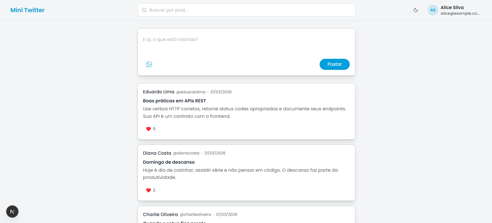 | 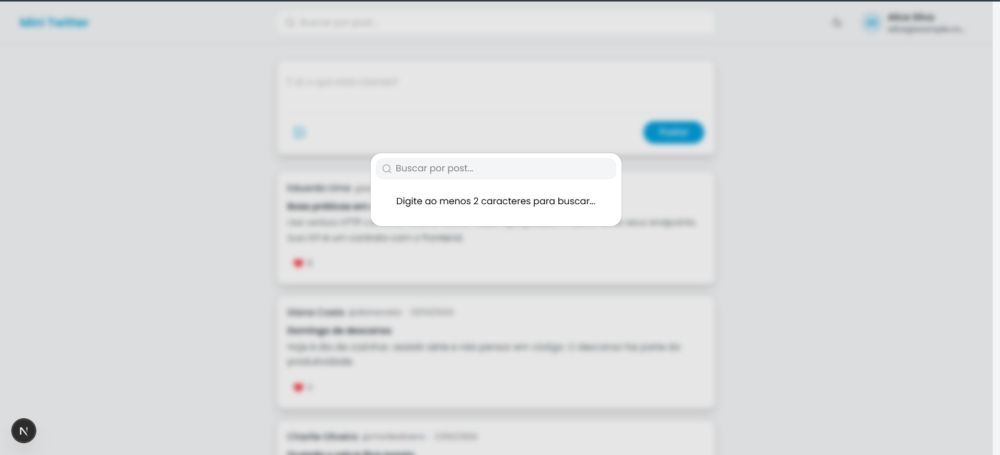 |
| 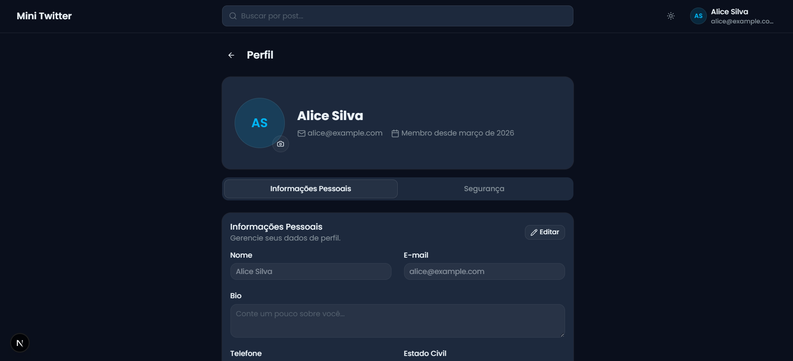 | 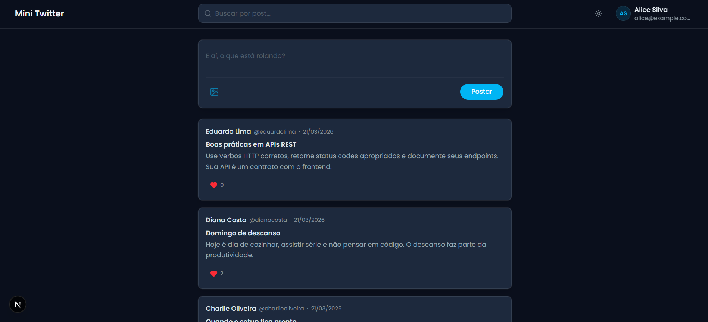 |

### Perfil do Usuário

| Informações Pessoais | Segurança |
|:---:|:---:|
| 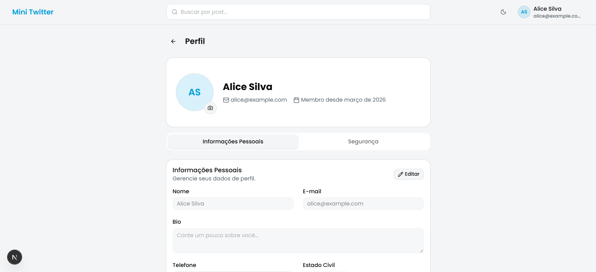 | 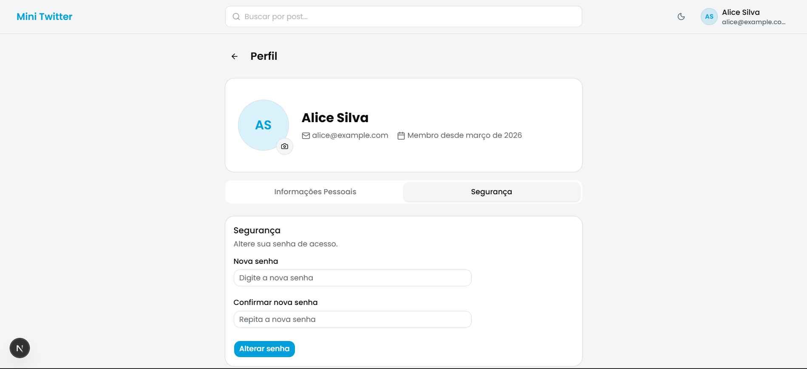 |
|  | 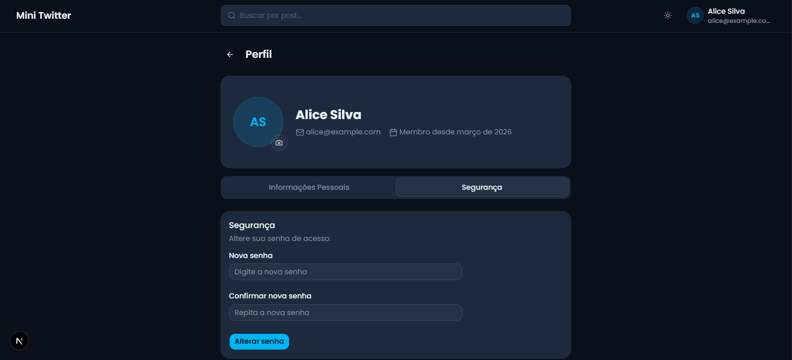 |

---

## ✨ Funcionalidades

### Publicações

| Funcionalidade | Descrição |
|---|---|
| **CRUD de Posts** | Criar, editar e excluir posts com validação e feedback visual |
| **Timeline Infinita** | Scroll infinito com `useInfiniteQuery` e carregamento automático |
| **Upload de Imagens** | Drag & drop com upload para Cloudinary (JPEG, PNG, WebP, GIF — até 5MB) |
| **Curtir / Descurtir** | Optimistic updates com rollback automático em caso de erro |
| **Comentários** | Sistema de comentários com respostas aninhadas e curtidas individuais |
| **Repost** | Compartilhar publicações de outros usuários no seu perfil |
| **Favoritos** | Salvar publicações para acessar posteriormente na aba de favoritos do perfil |
| **Contagem de Views** | Rastreamento de visualizações por publicação |
| **Busca em Tempo Real** | Command palette (`Ctrl+K`) com debounce e filtro por título |

### Social

| Funcionalidade | Descrição |
|---|---|
| **Seguir / Deixar de seguir** | Sistema de follows com contagem de seguidores e seguindo |
| **Perfil de Usuários** | Visualizar perfil de qualquer usuário clicando em seu nome (posts, avatar, bio) |
| **Perfil Completo** | Edição de dados pessoais, avatar e alteração de senha com tabs organizadas |
| **Busca de Usuários** | Sheet lateral para buscar e iniciar conversas com outros usuários |

### Chat em Tempo Real

| Funcionalidade | Descrição |
|---|---|
| **Mensagens via WebSocket** | Recebimento de mensagens em tempo real via WebSocket direto ao backend |
| **Envio via HTTP** | Envio de mensagens por HTTP POST para máxima confiabilidade |
| **Chat Popup** | Popup flutuante na timeline (desktop) para conversar sem sair da página |
| **Página de Chat** | Página dedicada `/chat` com sidebar de conversas e área de mensagens |
| **Layout Responsivo** | No mobile, sidebar e chat fazem toggle inteligente (um de cada vez) |
| **Nomes Clicáveis** | Nome/avatar no chat redirecionam para o perfil do usuário |

### Tour Guiado & Onboarding

| Funcionalidade | Descrição |
|---|---|
| **Modal de Boas-vindas** | Exibido na primeira visita com imagem, texto de boas-vindas e convite para o tour |
| **Tour da Página Inicial** | Guia interativo passo a passo: formulário de post, feed, sidebar, chat |
| **Tour do Perfil** | Tour detalhado cobrindo edição de dados, avatar, segurança e todas as tabs |
| **Tour do Chat** | Apresentação da interface de mensagens e como iniciar conversas |
| **Tour de Pesquisa** | Como utilizar a busca de posts e a busca de usuários |
| **Menu de Ajuda** | Ícone `?` no header com dropdown para acessar qualquer tour a qualquer momento |
| **Reset de Tours** | Ao selecionar um tour no menu, ele é resetado automaticamente para revisualizá-lo |
| **Mobile-Aware** | Steps com elementos ocultos no mobile são pulados automaticamente |

### Autenticação & Segurança

| Funcionalidade | Descrição |
|---|---|
| **JWT com Blacklist** | Registro, login e logout com invalidação de token via blacklist |
| **Proteção de Rotas** | Middleware server-side com cookies — sem flash de conteúdo não autorizado |
| **Dupla Persistência** | Token em localStorage (client) + Cookie HTTP (middleware server-side) |

### Interface & Responsividade

| Funcionalidade | Descrição |
|---|---|
| **Modo Dark / Light** | Tema persistido com design tokens em oklch e transição animada |
| **Sidebar Colapsável** | Menu lateral no desktop que expande ao passar o mouse (Início, Perfil, Chat) |
| **Mobile Bottom Nav** | Barra de navegação fixa no rodapé com scroll-hide (some ao rolar, reaparece ao parar) |
| **Header Mobile** | Menu hamburger com sheet lateral contendo navegação completa e logout |
| **Scroll-to-Top** | Botão flutuante para voltar ao topo + scroll automático ao navegar entre páginas |
| **Lazy Loading** | Dialogs de edição/exclusão carregados sob demanda via `React.lazy()` |

---

## 🛠️ Stack Técnica

### Frontend

| Tecnologia | Responsabilidade |
|---|---|
| [Next.js 16](https://nextjs.org/) | App Router, route groups, middleware SSR |
| [React 19](https://react.dev/) | Componentes funcionais com hooks |
| [TypeScript 5](https://typescriptlang.org/) | Tipagem estrita em todo o projeto |
| [TanStack Query](https://tanstack.com/query) | Cache, infinite queries, optimistic updates, mutations |
| [Zustand](https://zustand.docs.pmnd.rs/) | Estado global (auth, chat, likes) com persistência em localStorage |
| [React Hook Form](https://react-hook-form.com/) + [Zod](https://zod.dev/) | Formulários com validação declarativa e type-safe |
| [Tailwind CSS 4](https://tailwindcss.com/) | Design system com custom properties oklch |
| [Framer Motion](https://www.framer.com/motion/) | Transições fluidas de auth e animações do ScrollToTop |
| [shadcn/ui](https://ui.shadcn.com/) | Componentes base (Dialog, Sheet, Command, Button, Badge, Card, etc.) |
| [Axios](https://axios-http.com/) | HTTP client com interceptors (auth + redirect 401) |

### Backend

| Tecnologia | Responsabilidade |
|---|---|
| [Bun](https://bun.sh/) | Runtime JavaScript ultra-rápido |
| [Elysia](https://elysiajs.com/) | Framework HTTP type-safe + WebSocket nativo |
| [PostgreSQL](https://postgresql.org/) (Neon) | Banco de dados relacional serverless |
| [Cloudinary](https://cloudinary.com/) | CDN e otimização de imagens |

### Testes

| Ferramenta | Tipo |
|---|---|
| [Vitest](https://vitest.dev/) + [Testing Library](https://testing-library.com/) | Testes unitários de componentes |
| [Playwright](https://playwright.dev/) | Testes E2E (autenticação + posts) |

---

## 📁 Estrutura do Projeto

```
src/
├── app/
│   ├── (app)/              # Rotas protegidas
│   │   ├── layout.tsx      # Layout com Header, Sidebar, BottomNav, ChatProvider
│   │   ├── page.tsx        # Timeline (feed principal)
│   │   ├── chat/           # Página dedicada do chat
│   │   ├── favorites/      # Página de posts favoritados
│   │   ├── profile/        # Perfil do usuário logado
│   │   └── user/[id]/      # Perfil de outro usuário
│   ├── (auth)/             # Rotas públicas (login, registro)
│   ├── globals.css         # Design tokens (light + dark, oklch)
│   ├── layout.tsx          # Root layout com font e metadata
│   └── providers.tsx       # QueryClient, Theme, ErrorBoundary
├── components/
│   ├── auth/               # LoginForm, RegisterForm, AuthShell
│   ├── chat/               # ChatContent, ChatMain, ChatSidebar, ChatPopup, ChatFloatingBar
│   ├── header/             # HeaderDesktop, HeaderMobile, NavUser, UserSearchSheet
│   ├── navigation/         # MobileBottomNav (scroll-hide)
│   ├── posts/              # PostCard, PostForm, PostList, LikeButton, CommentItem
│   ├── profile/            # ProfileHeader, PersonalInfoTab, SecurityTab, ProfileContent
│   ├── sidebar/            # AppSidebar (colapsável)
│   ├── tour/               # GuidedTour, HelpMenu, WelcomeModal
│   └── ui/                 # Componentes base (shadcn/ui)
├── lib/
│   ├── api/                # Configuração Axios com interceptors
│   ├── hooks/              # useAuth, usePosts, useLike, useChat, useMobile, etc.
│   ├── schemas/            # Schemas Zod (login, register, post, profile)
│   ├── store/              # Stores Zustand (authStore, chatStore)
│   ├── types/              # Interfaces TypeScript (User, Post, Message, Conversation)
│   └── utils/              # Helpers, constantes, tourConfigs
└── proxy.ts                # Middleware de proteção de rotas (SSR)
```

---

## 🚀 Getting Started

### Pré-requisitos

- **Node.js** 18+ (ou [Bun](https://bun.sh/) para o backend)
- **pnpm** (recomendado) ou npm

### 1. Clone o repositório

```bash
git clone https://github.com/Fabricio0101/Mini_Twitter.git
cd mini-twitter
```

### 2. Instale as dependências

```bash
pnpm install
```

### 3. Configure o ambiente

```bash
cp .env.example .env.local
```

Edite `.env.local` com a URL da API:

```env
NEXT_PUBLIC_API_URL=http://localhost:3000
```

### 4. Inicie o servidor de desenvolvimento

```bash
pnpm dev
```

A aplicação estará disponível em **http://localhost:3001**.

> **Nota:** O backend deve estar rodando na porta 3000. Consulte o repositório do backend para instruções de setup.

---

## 🧪 Testes

```bash
# Testes unitários
pnpm vitest run

# Testes E2E (requer backend rodando)
pnpm playwright test
```

---

## 🏗️ Decisões de Arquitetura

### Optimistic Updates

O hook `useLike` atualiza o estado visual **imediatamente** ao clicar, sem aguardar a resposta do servidor. Em caso de falha na requisição, executa rollback automático para o estado anterior. Isso elimina a latência percebida pelo usuário.

### Zustand vs Context API

O Zustand foi escolhido por três motivos:
1. **Performance** — não causa re-renders desnecessários como o Context
2. **Persistência nativa** — middleware `persist` mantém a sessão entre reloads
3. **API minimalista** — zero boilerplate comparado ao Redux

### Dupla Persistência do Token

O token JWT é armazenado em dois locais:
- **localStorage** (via Zustand) — para uso client-side
- **Cookie HTTP** — para leitura no middleware Next.js server-side

Isso permite que o middleware `proxy.ts` proteja as rotas **antes** do React sequer carregar, prevenindo qualquer flash de conteúdo não autorizado.

### Chat: HTTP + WebSocket

O sistema de chat usa uma abordagem híbrida:
- **WebSocket** — exclusivo para **recebimento** de mensagens em tempo real, conectando diretamente ao backend (bypass do proxy Next.js que não suporta WS)
- **HTTP POST** — exclusivo para **envio** de mensagens, garantindo confiabilidade e tratamento de erros adequado

### Tour Guiado Inteligente

O sistema de tour é viewport-aware:
- Steps cujo elemento-alvo está oculto (ex: sidebar, popup no mobile) são **pulados automaticamente**
- A largura do tooltip se adapta ao viewport: `Math.min(320, viewportWidth - 32)`
- O recurso `clickOnArrive` permite que tabs sejam clicadas automaticamente durante o tour

### Lazy Loading de Dialogs

Os componentes `PostEditDialog` e `DeletePostDialog` são importados via `React.lazy()` com `Suspense`. Isso reduz o bundle inicial — os modais só são carregados quando o usuário efetivamente abre o dropdown de ações de um post.

### Upload de Imagens

O sistema suporta upload via **drag & drop** e **seleção de arquivo**. As imagens são enviadas para o **Cloudinary** via endpoint dedicado (`/upload`), que retorna a URL otimizada. O limite é de 5MB por imagem, nos formatos JPEG, PNG, WebP e GIF.

### Responsividade Mobile-First

- **MobileBottomNav** — navegação fixa no rodapé com detecção de scroll via `requestAnimationFrame` para hide/show suave
- **Chat Toggle** — no mobile, sidebar de conversas e área de mensagens fazem toggle (um substitui o outro), com botão de voltar
- **Sheet de Navegação** — substitui a sidebar do desktop com menu completo
- **Popup do Chat** — exibido apenas no desktop (`hidden md:block`), no mobile o usuário usa a página `/chat`

---

## 📄 Licença

Este projeto foi desenvolvido como parte de um desafio técnico para a **B2BIT**.
